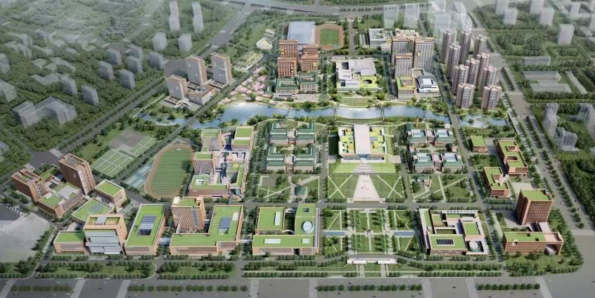
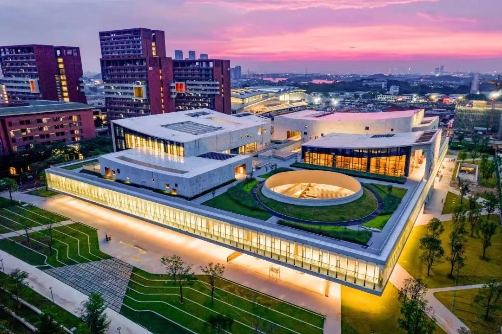

# Contact information

## For contacting PI (see [Opportunity](./opportunity) for potential positions)
* Email: **wanghengscut@scut.edu.cn**
* Mailing address: 

Building D1, Block a, Room 505  
Guangzhou International Campus  
South China University of Technology  
777 Xingye Avenue East, Panyu District  
Guangzhou, Guangdong, China  

## Lab location

Building D1, Block b, Room 341  
Guangzhou International Campus  
South China University of Technology  
777 Xingye Avenue East, Panyu District  
Guangzhou, Guangdong, China  

<iframe src="https://map.baidu.com/poi/%E5%8D%8E%E5%8D%97%E7%90%86%E5%B7%A5%E5%A4%A7%E5%AD%A6%E5%B9%BF%E5%B7%9E%E5%9B%BD%E9%99%85%E6%A0%A1%E5%8C%BA-D1B%E5%BA%A7/@12624112.86028779,2617262.7666862365,15.25z?uid=a4dce2e9847da84ecac3dbc2&info_merge=1&isBizPoi=false&ugc_type=3&ugc_ver=1&device_ratio=2&compat=1&pcevaname=pc4.1&querytype=detailConInfo&da_src=shareurl" width="800" height="450" style="border:0;" allowfullscreen="" loading="lazy" referrerpolicy="no-referrer-when-downgrade"></iframe>

## Gallery of the South China Univerity of Technology(GZIC)

{: width="800px"} 

{: width="800px"} 

{: width="800px"} 

{: width="800px"} 

{: width="800px"} 

{: width="800px"} 

{: width="800px"} 

 

[back](./)

