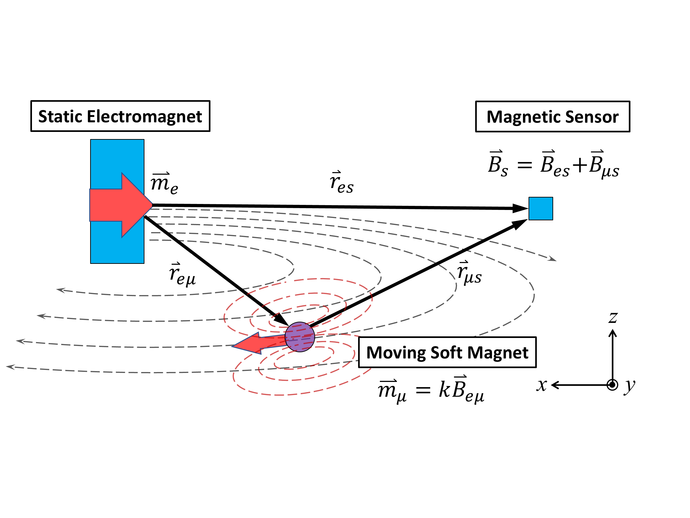
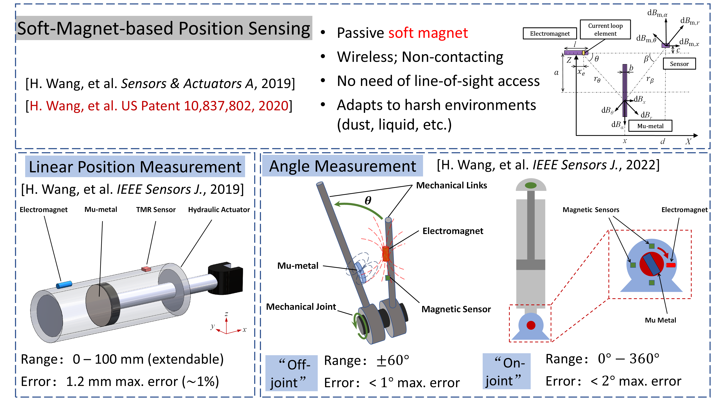
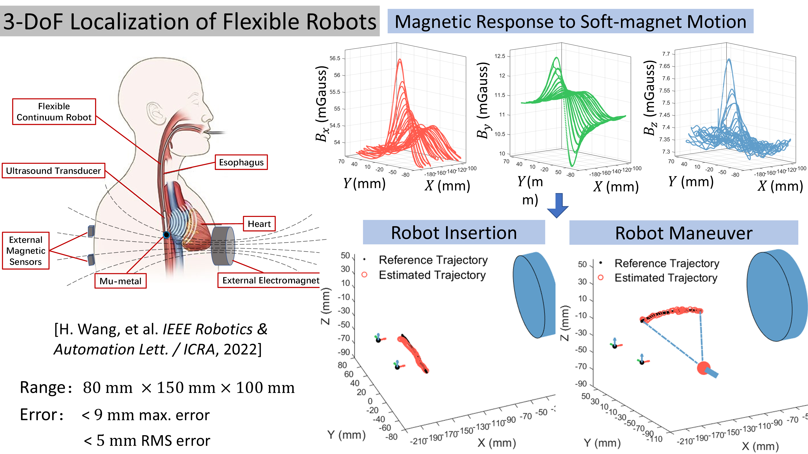
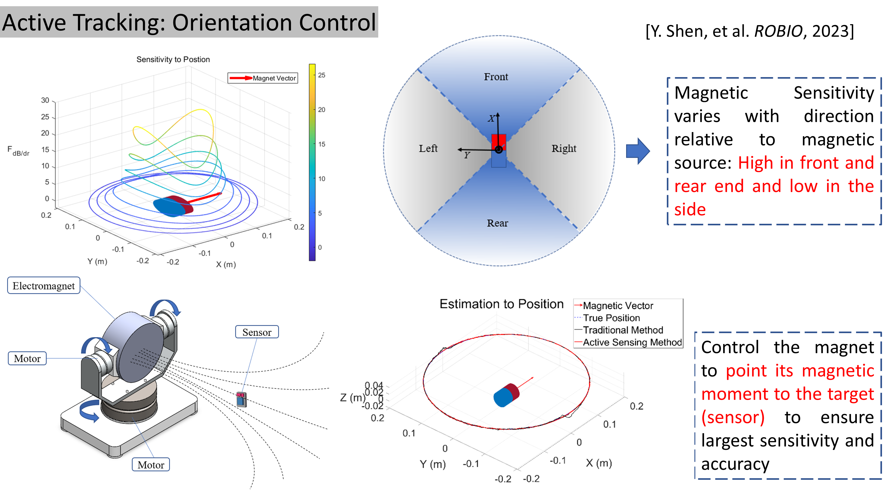
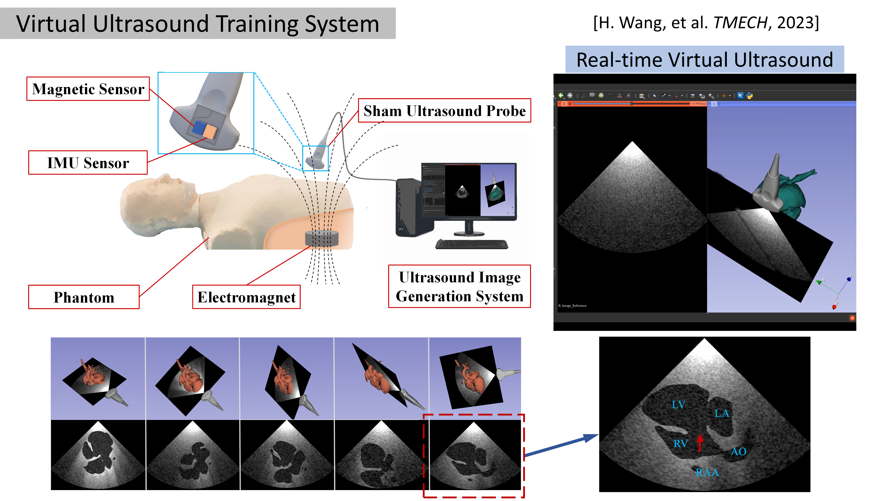

# Research

The research of our Lab is focused on the following areas: 

* Novel magnetic sensing and actuation principles, including new magnetic materials, structures and functions. 
* Intelligent estimation, control, planning, and learning algorithms for magnetically navigated medical robots.
* Multi-functional magnetic navigation systems for pose tracking, shape sensing, locomotion, and manipulation of multi-scale miniature medical robots (e.g., capsule robots, continuum robots, micro-nano robots, etc.)
* Simulation and virtual training platforms to facilitate research, development and application of magnetic robots in minimally invasive medicine.

 

---------
*********

# **New Magnetic Tracking Method: Soft-Magnet-based Pose Tracking System**

 

> Conventional magnetic tracking systems can be categorized as electromagnet-based systems (EM) and permanent-magnet-based systems (PM). EM tracking systems use a magnetic sensor on the target to measure the magnetic field of stationary electromagnet sources for pose estimation. However, EM systems need electric wiring to the moving sensor, which is delicate and easily broken. The wiring issue also prevents the EM systems from tracking untethered robots. PM tracking systems use an array of magnetic sensors to track a permanent magnet on the target. However, PM systems can only achieve 5-DoF pose tracking and suffer from ambient ferromagnetic disturbances.

> To address the above challenges in existing magnetic tracking systems, our lab proposes and develops a new magnetic tracking system based on the soft magnet with high magnetic permeability and low coercivity. A piece of soft magnet is attached to the target while an excitation electromagnet and magnetic sensors are stationary. The soft magnet experiences a position-dependent magnetization by the alternating magnetic field from the electromagnet, and then it generates a secondary magnetic field, which is measured for pose estimation. **The soft-magnet-based tracking system is wireless, non-contacting, and robust to magnetic disturbances.** This new soft-magnet-based tracking method has been uitilized for 1-DoF linear/angular position measurement, 3-DoF position tracking, and 6-DoF pose tracking of various medical robots and devices.

## Soft-Magnet-based Tracking: 1-DoF Linear/Angular Position Measurement System

[1] **H. Wang** and R. Rajamani*, “A Remote Position Sensing Method Based on Passive High Magnetic Permeability Thin Films”, Sensors and Actuators A: Physical, vol. 295, pp. 217-223, 2019.

[2] **H. Wang**, R. Madson and R. Rajamani*, “Electromagnetic Position Measurement System Immune to Ferromagnetic Disturbances”, IEEE Sensors Journal, vol. 19, no. 21, pp. 9662-9671, July 2019.

[3] **Heng Wang***#, Shuangyi Wang#, Rajesh Rajamani, “Electromagnetic Angular Position Sensing Using High-Magnetic-Permeability Materials”, IEEE Sensors Journal, vol. 22, no. 12, pp. 11626-11636, 2022.

 

> The soft-magnet-based position sensing principle is utilized to develop linear position measurement systems for linear industrial actuators and angular position measurement systems for rotational mechanical joints.

<iframe width="820" height="462" src="https://www.youtube.com/embed/vYDYIHm5EN0" title="YouTube video player" frameborder="0" allow="accelerometer; autoplay; clipboard-write; encrypted-media; gyroscope; picture-in-picture" allowfullscreen></iframe>

## Soft-Magnet-based Tracking: 3-DoF Position Tracking of Flexible Robots
[4] **H. Wang**#, S. Wang#, H. Liu, K. Rhode, Z. G. Hou, R. Rajamani*, “3-D Electromagnetic Position Estimation System Using High-Magnetic-Permeability Metal for Transluminal Continuum Medical Robots”,  IEEE Robotics and Automation Letters (also reported on ICRA 2022), vol. 7, no. 2, pp. 2581 – 2588, Jan. 2022.

 

>  The soft-magnet-based position sensing principle is utilized to develop a 3-DoF position tracking system for a flexible medical robot. The highly nonlinear magnetic response to soft-magnet motion is modeled. Experimental results show that the position tracking error is below 5 mm.

## Soft-Magnet-based Tracking: 6-DoF Pose Tracking System
[5] S. Liu, **H. Wang***, A wireless 6-DoF pose tracking system using a triaxially anisotropic soft magnet, IEEE/ASME Transactions on Mechatronics, 2024.

 

> The soft-magnet-based position sensing principle is extended for 6-DoF pose tracking. A triaxially anisotropic soft magnet is used as the sensitive target instead of a spherical soft magnet. The geometry-dependent anisotropic magnetization of the soft magnet enables 3-DoF orientation sensing. The developed soft-magnet tracking system can achieve full 6-DoF pose tracking with a passive magnet, which is not feasible in existing permanent-magnet tracking systems.

# **Active Electromagnetic Tracking Systems**

We develope active electromagnetic tracking technologies to improve tracking accuracy, to enlarge workspace, and to save energy of electromagnetic tracking systems.

## Active Tracking: Electromagnet Current Control
[6] **H. Wang**, A. Zemouche and R. Rajamani*, “Nonlinear Observer for Electromagnetic Position Estimation Using Active Current Control”, Mechanical Systems and Signal Processing, vol. 167, 108449, 2022.

[7] **Heng Wang** and Rajesh Rajamani*, “Electromagnetic Position Estimation Using Active Current Control and Nonlinear Observer”, in 2020 American Control Conference (ACC), Denver, USA, 2020. (ASME DSCD Mechatronics TC Best Paper Award)

 

> The current supply to the electromagnet source is actively controlled during pose tracking. The current is increased when the sensor (target) moves away from the electromagnet to remedy the magnetic sensitivity. An optimal current profile is designed and the current is controlled according to the profile based on the position estimate of the target. A nonlinear observer is designed to guarantee stability of both current control and position estimation.

## Active Tracking: Electromagnet Orientation Control
[8] Y. Shen, S. Dong, D. Liu, K. Zhang, **H. Wang***, "Active 6-DoF Electromagnetic Pose Tracking Using Orientation Control of the Magnetic Source", IEEE International Conference on Robotics and Biomimetics (ROBIO), 2023.

 

> The orientation of the electromagnet source is actively controlled to always point to the sensor (target) to maintain the optimal tracking accuracy.

# **Magnetic-Inertial Tracking System**

We fuse magnetic sensing and inertial sensing to achieve accurate and robust 6-DoF pose tracking for various medical applications, e.g., medical robot localization and virtual medical training.

## Developement of Magnetic-Inertial Tracking System

[9] S. Dong, **H. Wang***, A compact and robust 6-DoF pose tracking system using magnetic-inertial sensors and a single uniaxial electromagnetic coil, IEEE Sensors Journal, Dec. 2023.

 

> In magnetic-inertial tracking systems, only one electromagnetic coil is used, which makes the system compact. Fused with an inertial sensor, the tracking system become more robust.

## Virtual Ultrasound Training System based on Magnetic-Inertial Probe Tracking

[10] **H. Wang**#, S. Dong#, Q. Yang, J. Han, Z. He, Y. He*, S. Wang*, "A virtual ultrasonography simulator for skill training using magnetic-inertial probe tracking," IEEE/ASME Transactions on Mechatronics, June 2023.

 

> A compact, inexpensive, and interactive ultrasonography simulator is developed using magnetic-inertial probe tracking and virtual ultrasound image generation. Embedded with magnetic and inertial sensors, the sham ultrasound probe is tracked by fusing magnetic measurement of a single electromagnet embedded in the phantom and inertial measurement of the probe. Then the virtual scan plane is determined according to the estimated probe pose to slice the digital anatomical model
for virtual image generation, providing visual feedback for skill training. Due to intuitive freehand interaction, accurate probe tracking, and real-time visual guidance of ultrasound images and three-dimensional (3-D) virtual scene of the probe and anatomy, the proposed simulator can provide immersive training experience for quick ultrasound skill acquirement.

## Bio-inspired swimming robots
[9] Ren, Z.#, Hu, W.#, **Dong, X.** and Sitti, M., 2019. Multi-functional soft-bodied jellyfish-like swimming. Nature communications, 10(1), pp.1-12. [Link](https://www.nature.com/articles/s41467-019-10549-7.pdf)

 

> The functionalities of the untethered miniature swimming robots significantly decrease as the robot size becomes smaller, due to limitations of feasible miniaturized on-board components. Here we propose an untethered jellyfish-inspired soft millirobot that could realize multiple functionalities in moderate Reynolds number by producing diverse controlled fluidic flows around its body using its magnetic composite elastomer lappets, which are actuated by an external oscillating magnetic field. We particularly investigate the interaction between the robot’s soft body and incurred fluidic flows due to the robot’s body motion, and utilize such physical interaction to achieve different predation-inspired object manipulation tasks. The proposed lappet kinematics can inspire other existing jellyfish-like robots to achieve similar functionalities at the same length and time scale. Moreover, the robotic platform could be used to study the impacts of the morphology and kinematics changing in ephyra jellyfish.

---------
*********

# **Swarm microrobots**
* **Key words**: control, collective motion, cooperative behaviors

 

## Reconfigurable and cooperative swarms
[10] Dong, X. and Sitti, M., 2020. Controlling two-dimensional collective formation and cooperative behavior of magnetic microrobot swarms. The International Journal of Robotics Research, 39(5), pp.617-638. [Link](https://journals.sagepub.com/doi/full/10.1177/0278364920903107)

<iframe width="410" height="307" src="https://www.youtube.com/embed/TVcUt4bgYEE" title="YouTube video player" frameborder="0" allow="accelerometer; autoplay; clipboard-write; encrypted-media; gyroscope; picture-in-picture" allowfullscreen></iframe>

<iframe width="410" height="307" src="https://www.youtube.com/embed/1NgyePOxXTI" title="YouTube video player" frameborder="0" allow="accelerometer; autoplay; clipboard-write; encrypted-media; gyroscope; picture-in-picture" allowfullscreen></iframe>

## Programmable static formations
[11] Dong, X. and Sitti, M., 2019. Collective Formation and Cooperative Function of a Magnetic Microrobotic Swarm. In Robotics: Science and Systems. [Link](http://m.roboticsproceedings.org/rss15/p07.pdf)

 
> Magnetically actuated mobile microrobots can access distant, enclosed, and small spaces, such as inside microfluidic channels and the human body, making them appealing for minimally invasive tasks. Despite their simplicity when scaling down, creating collective microrobots that can work closely and cooperatively, as well as reconfigure their formations for different tasks, would significantly enhance their capabilities such as manipulation of objects. However, a challenge of realizing such cooperative magnetic microrobots is to program and reconfigure their formations and collective motions with under-actuated control signals. This article presents a method of controlling 2D static and time-varying formations among collective self-repelling ferromagnetic microrobots (100 μm to 350 μm in diameter, up to 260 in number) by spatially and temporally programming an external magnetic potential energy distribution at the air–water interface or on solid surfaces. A general design method is introduced to program external magnetic potential energy using ferromagnets. A predictive model of the collective system is also presented to predict the formation and guide the design procedure. With the proposed method, versatile complex static formations are experimentally demonstrated and the programmability and scaling effects of formations are analyzed. We also demonstrate the collective mobility of these magnetic microrobots by controlling them to exhibit bio-inspired collective behaviors such as aggregation, directional motion with arbitrary swarm headings, and rotational swarming motion. Finally, the functions of the produced microrobotic swarm are demonstrated by controlling them to navigate through cluttered environments and complete reconfigurable cooperative manipulation tasks.

(# indicates equal contribution)

[back](./)

